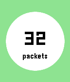

Reworking Tricorder app to work with original Pebble smartwatch

Tricorder
=========

> In the fictional Star Trek universe, a tricorder is a multifunction hand-held
device used for sensor scanning, data analysis, and recording data.
***- Wikipedia***

Tricorder is an example [Data Logging](http://developer.getpebble.com/guides/pebble-apps/communications/pebble-datalogging/)
application. It's also very useful for diagnosing issues with your current Data
Logging setup.

It's composed of a Pebble, iOS, and Android application.

Getting Started
---------------

After you've built and installed the Pebble app and either the iOS or Android
app you can begin datalogging.

On the Pebble app everytime you click the select button a packet of information
is generated every tenth of a second. When you click the select button again the
data is sent to either the iOS or Android device, and the counter is reset on
the Pebble. This app also utilizes background workers. If you back out of the
app while packets are being generated, they'll continue to be generated in the
background.

> Background workers are not a necessary component to all data logging apps.

### Packets

Each packet consists of the following data:

- Packet Id
- Timestamp
- Connection Status
- Charge Percent
- Accel Data
	- X Acceleration
	- Y Acceleration
	- Z Acceleration
	- Did Vibrate
	- Timestamp
- CRC32 Checksum

### Error Catching

Packets of this data are sent to the iOS or Android device, and the following is
determined:

- Number of malformed packets (using CRC32)
- Duplicate packets
- Out of Order packets
- Dropped packets

## License

[MIT](./LICENSE)
